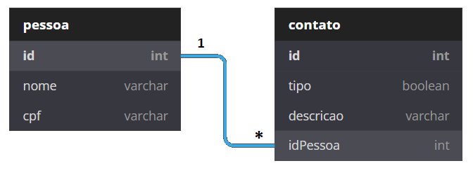

<div align='center'>
 

 
 </div>

# Teste para vaga de Arquiteto de Software no Magazord.com.br

Este repositório tem como fim testar os candidatos para vaga de Arquiteto de Software na empresa [Magazord](https://magazord.com.br).

> Para esta vaga buscamos alguém apaixonado por desafios, tenha facilidade em aprendizado de diferentes tecnologias e que esteja sempre atento aos detalhes!

## Primeira etapa:

O objetivo deste etapa é garantir que suas habilidades de modelagem e programação sejam postas a prova. O importante é o funcionamento, cumprimento com os requisitos e utilização de boas práticas. O visual da aplicação é secundário, não será critério de avaliação.

Será realizado um simples sistema de contatos, utilizando PHP, JS, HTML, CSS e Banco de Dados. É necessário que o sistema utilize o padrão MVC e que seja orientado a API.

> [!NOTE]
> Como opcional desacoplar a camada de operação para conseguir consumir por API e por linha de comando (chamada direta por ```php [classe] [parametros]```)

> [!IMPORTANT]
> **Não deve ser utilizado framework para o desenvolvimento da aplicação backend.**

> [!IMPORTANT]
> **Para o contexto frontend podem ser utilizados frameworks JS para simplificar o desenvolvimento, porém é importante se atentar as práticas de integração no momento da sua construção.**

> [!IMPORTANT]
> **É de extrema importância um arquivo README para instrução de como executar o projeto, sendo ponto de destaque o uso de metodologias de automação para execução do projeto considerando relacionamento de dependências ou provisionamento de recursos como versão de dependências, linguagem e banco de dados para o projeto.**

### Requisitos funcionais:

> - RF01 - O sistema deve manter uma tela de consulta para pessoas.
> 
> - RF02 - O sistema deve manter um campo de pesquisa por nome de pessoa.
> 
> - RF03 - O sistema deve manter uma tela de consulta para contatos.
> 
> - RF04 - O sistema deve manter um CRUD (Cadastrar, Visualizar, Alterar, Excluir) para pessoas.
> 
> - RF05 - O sistema deve manter um CRUD (Cadastrar, Visualizar, Alterar, Excluir) para contato.

### Requisitos não funcionais:

> - RNF01 - O sistema deve utilizar a linguagem PHP para o Back-end.
> 
> - RNF03 - O sistema deve utilizar Docker para definição do ambiente.
> 
> - RNF04 - O sistema deve utilizar docker-compose para orquestração de containers.
> 
> - RNF03 - O sistema deve utilizar JS, HTML, CSS.
> 
> - RNF04 - O sistema deve ser organizado pelo padrão MVC.
> 
> - RNF05 - O sistema deve utilizar o Composer para gerenciamento de dependências.
> 
> - RNF06 - O sistema deve utilizar um banco de dados SQL (postgres ou mysql).
> 
> 
> - RNF07 - O sistema deverá ter seu controle de versão no Github.

### Regra de Negócio:

> - RN01 - São dados de pessoas: Nome e CPF.
> 
> - RN02 - São dados de contato: Tipo (Telefone ou Email), Descrição.
> 
> - RN03 - Uma pessoa pode ter vários contatos

### Aplicação de Design Patterns

A baixo são apresentados alguns padrões de projetos que podem ser aplicados na arquitetura do projeto proposto, utilize-os e apresente no arquivo README.md onde, como e porque da utilização deles. Fique a vontade para incluir outros padrões e descreve-los da mesma forma

> - Repository Pattern
> - Factory Pattern
> - Singleton Pattern
> - Strategy Pattern
> - Dependency Injection Pattern
> - Front Controller Pattern

## Segunda etapa:

O objetivo deste etapa é garantir que suas habilidades de refatoração, analise critíca e clean code. O importante é a utilização de boas práticas.

> A classe a ser refatorada é [Login.php](./segunda-etapa/Login.php)

> [!IMPORTANT]
> **É de extrema importância que o código tenha comentários em código deixando claro os objetivos e que no arquivo README conste as instrução das mudanças e quais os beneficios alcançados com as alterações em código.**

## Envio do teste

> [!NOTE]
> **Suba o repositório no seu Github e envie o link diretamente para o seu recrutador.**

> [!WARNING]
> **Não serão aceitos alterações após o envio, caso precise de mais tempo para implementação do projeto alinhe com o seu recrutador com antecedência.**
